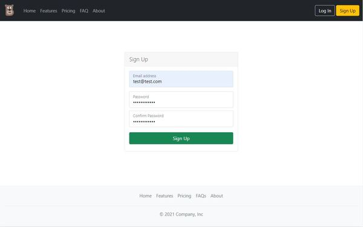
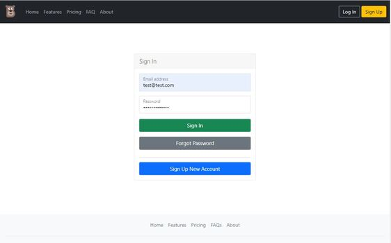
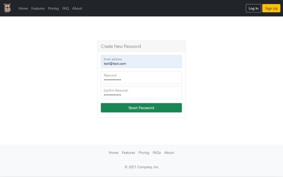

# PHP, Ajax and MySQL Login/Registration System 
User authentication system used to authorize and restrict users to certain pages in a web appplication.

Login and Registration system uses:
  - PHP
  - MySQL (and PDO, not MySQLi function)
  - JavaScript, jQuery and Ajax
  - Ajax will return JSON formats

## Sources 

[Arkmont.com/create-php-and-ajax-login-registration-system](https://arkmont.com/create-php-and-ajax-login-registration-system)

## Sign Up

### - MySQL Database Setup
The database used is MySQL, so you'll need a MySQL database to create the users table.
Run the `database/setup-sql.sql` file in MySQL database to create users table

### - Database Connection
The PHP script to connect to the database is in `inc/classes/DB.php` directory.
Replace credentials to in `DB.php` to match your server credentials.

### - Registration Form
The `signup.php` creates a web form that allows users to register.
The script generates error if form input is empty, email or password does not meet the validation criteria or account already exist.

## AJAX

The ajax POST request is made on click of submit button. The `ajax/*` file is used to read information from the request and returns a response in JSON format. The request is handled in backend and response is displayed via alert method.

The `main.js` script contains all the form validation and AJAX logic. 

The `inc/classes/User.php` perform User functions. For example, Find function finds if user exists is database or not.

The `inc/classes/Page.php` script restrict user access to dashboard if user is not logged in or if user is logged in, user is forced redirect to dashboard.

## Sign In 

### - Sign In Form and Script
The `signin.php` is the signin script.
When a user submit a form with username and password, these inputs will be verified against the credentials data stored in the database, if there is a match then the user will be authorized and granted access to site or page.

## Dashboard

User is redirected to `dashboard.php` if login is successful.

## Password Reset

The logged in user can reset password for registered account.
The reset password script is in `resetpassword.php`

## Libraries

- JQuery
- Bootstrap (optional)

